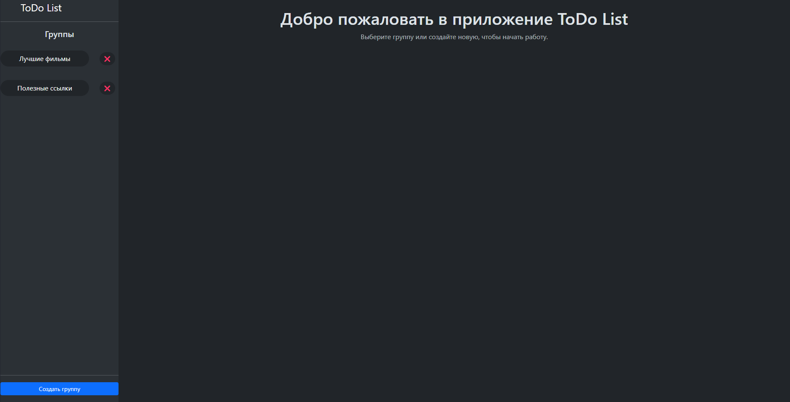
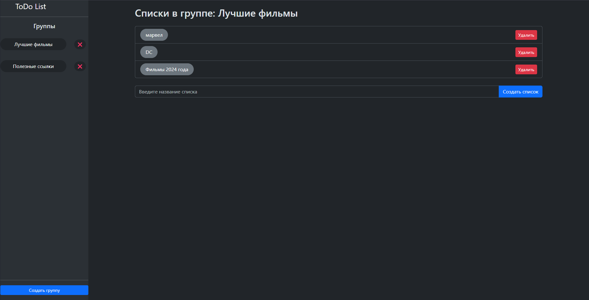
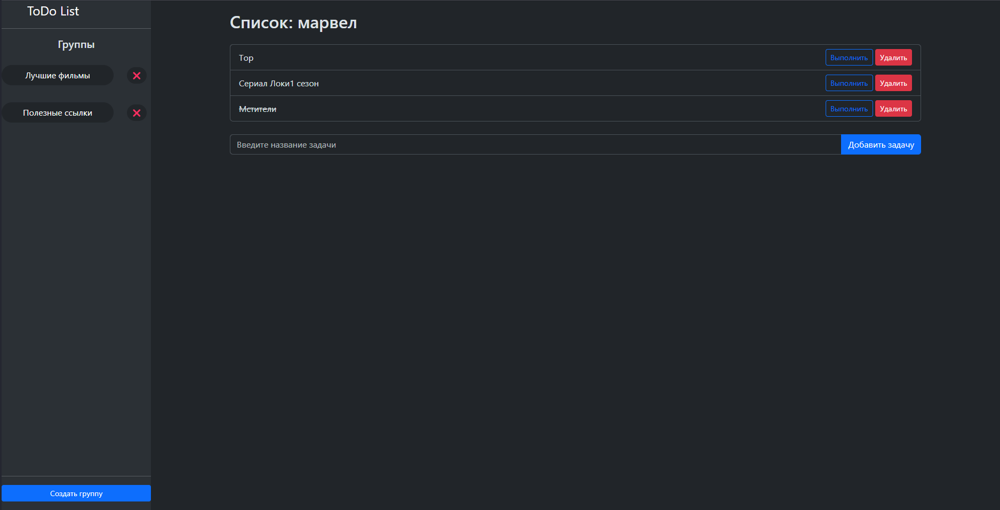

# 📝 ToDo List Application

## 📖 Описание проекта
ToDo List Application — это простое веб-приложение для управления задачами.  
Позволяет пользователям создавать **группы**, внутри которых можно добавлять **списки**, а затем записывать в них **задачи**.  

**Основные функции:**
- ✅ Создание, удаление и управление **группами**.
- 📂 Создание и редактирование **списков** в группах.
- 📝 Добавление, выполнение и удаление **задач**.
- 🔄 Обновление интерфейса без перезагрузки страницы (AJAX).

## 🛠️ Технологии
- **Backend:**  
  - Java 17 (Gradle)
  - Spring Boot 3  
  - Spring MVC  
  - Spring Data JPA  
  - PostgreSQL  
  - Hibernate
  - Lombok

- **Frontend:**  
  - HTML + Thymeleaf  
  - CSS (Bootstrap 5)  
  - JavaScript (Fetch API)  

## ⚙️ Установка и запуск

### 1️⃣ Склонируйте репозиторий  
```sh
git clone https://github.com/Ognikus/todo-list-app.git
cd todo-list-app
```
### 2️⃣ Настройка базы данных
```sh
CREATE DATABASE todolist;
```
Настройте **application.properties**:
```sh
server.port=8080
spring.jpa.hibernate.ddl-auto=update
spring.datasource.url=jdbc:postgresql://localhost:5432/TodoList
spring.datasource.username=your_username
spring.datasource.password=your_password
```
Таблицы создадутся автоматически при первом запуске приложения

### 3️⃣ Запуск приложения
Открыть в браузере:
```sh
http://localhost:8080/groups
```

### 📸 Скриншоты
## Главная страница

## 📂 Списки задач  

## 🎯 Задачи  

